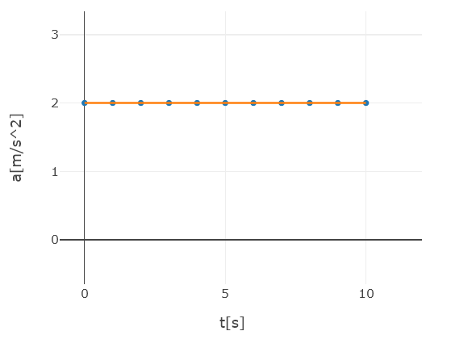
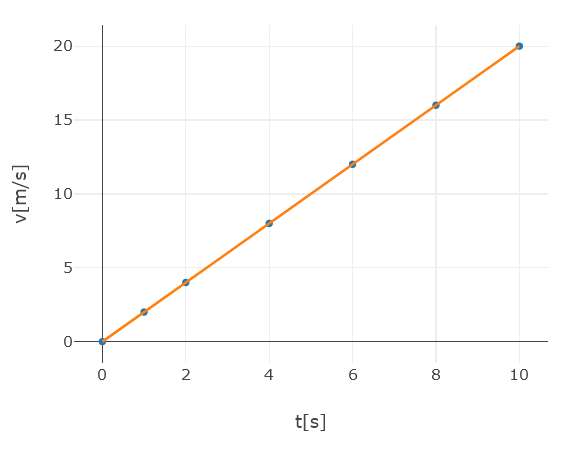
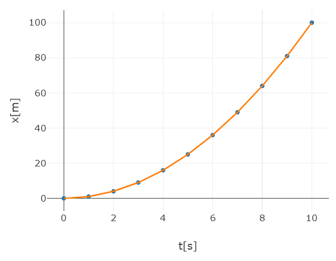

# ayudantia-02

viernes 22 marzo 2024

## resumen

### aceleración media

$$a = \frac{v(t_2) - v(t_1)}{t_2 - t_1}$$

### velocidad media

$$v = \frac{x(t_2) - x(t_1)}{t_2 - t_1}$$

### movimiento uniformemente acelerado

aceleración en el tiempo constante:

$$a(t) = constante$$

velocidad en el tiempo:

$$v(t) = v_{inicial} + a \cdot t$$

posición en el tiempo:

$$x(t) = x_{inicial} + v_{inicial} \cdot t + \frac{1}{2} \cdot a \cdot t^2 $$

### segunda ley de newton

$$\vec{F} = m \cdot \vec{a}$$

### ley de gravitación universal

$$F_g = G\frac{m_1 \cdot m_2}{r^2}$$

### aceleración de gravedad

$$g = 9.8 \ [m/s^2]$$

## ejercicio-01: fuerza, masa y aceleración

Un vehículo de $100[kg]$ de masa se mueve en línea recta a $70[km/h]$. ¿Qué fuerza debe aplicarse en forma constante para que reduzca su velocidad a $20[km/h]$, 10 segundos después de aplicada la fuerza?

## solución ejercicio-01

calculamos la aceleración:

$$a=\frac{20[km/h] - 70[km/h]}{10[seg]}$$

$$a=\frac{-50[km/h]}{10[seg]}$$

$$a=\frac{-13.88[m/s]}{10[s]}$$

$$a = -1.388[m/s^2]$$

por lo tanto la fuerza requerida es:

$$F=m \cdot a$$

$$F=100[kg] \cdot (-1.388)[m/s^2]$$

$$F = -138.8[kg \cdot m/s^2]$$

$$F = -138.8[N]$$

## ejercicio-02: movimiento uniformemente acelerado

Un ciclista comienza su paseo matutino y al cabo de 10 segundos su velocidad es de $7.2 \ km/h$. En ese instante ve aproximarse un perro y comienza a frenar durante 6 segundos hasta que la bicicleta se detiene. Calcular:

a) La aceleración hasta que comienza a frenar.

b) La aceleración con la que frena la bicicleta.

c) La distancia total recorrida.

## solución ejercicio-02

a)

$$a_1 = \frac{7.2 [\frac{km}{h}] - 0 [\frac{km}{h}]}{10[s] - 0[s]}$$

$$a_1 = \frac{7.2 [\frac{km}{h}]}{10[s]}$$

$$a_1 = \frac{2 [\frac{m}{s}]}{10[s]}$$

$$a_1 = \frac{1}{5}\left[\frac{m}{s^2}\right]$$

$$a_1 = 0.2\left[\frac{m}{s^2}\right]$$

b)

$$a_2 = \frac{0 [\frac{km}{h}] - 7.2 [\frac{km}{h}]}{16[s] - 10[s]}$$

$$a_2 = \frac{- 7.2 [\frac{km}{h}]}{6[s]}$$

$$a_2 = \frac{- 2 [\frac{m}{s}]}{6[s]}$$

$$a_2 = -\frac{1}{3}\left[\frac{m}{s^2}\right]$$

$$a_2 \approx -0.33\left[\frac{m}{s^2}\right]$$

c) La distancia total recorrida es la suma entre lo que recorrió en la primera fase y lo que recorrió la segunda fase.

Usando la fórmula para el movimiento uniformemente acelerado, en la primera fase:

$$x(t) = x_{inicial} + v_{inicial} \cdot t + \frac{1}{2} \cdot a \cdot t^2 $$

$$x(10[s]) = 0 + 0 \cdot 10[s] + \frac{1}{2} \cdot 0.2\left[\frac{m}{s^2}\right] \cdot (10[s])^2 $$

$$x(10(s)) = \frac{1}{2} \cdot 0.2\left[\frac{m}{s^2}\right] \cdot (10[s])^2 $$

$$x(10(s)) = 0.1\left[\frac{m}{s^2}\right] \cdot 100[s^2] $$

$$x(10(s)) = 10[m] $$

en la segunda fase:

$$x(6[s]) = 0 + 7.2 [\frac{km}{h}] \cdot 6[s] + \frac{1}{2} \cdot -0.33\left[\frac{m}{s^2}\right] \cdot (6[s])^2 $$

$$
x(6[s]) = 0 + 2 [\frac{m}{s}] \cdot 6[s] + \frac{1}{2} \cdot -0.33\left[\frac{m}{s^2}
\right] \cdot (6[s])^2
$$

$$
x(6[s]) = 12 [m] + \frac{1}{2} \cdot -0.33\left[\frac{m}{s^2}
\right] \cdot 36[s^2]
$$

$$
x(6[s]) = 12 [m] + -0.33\left[\frac{m}{s^2}
\right] \cdot 18[s^2]
$$

$$x(6[s]) = 12 [m] - 6[m]$$

$$x(6[s]) = 6 [m]$$

finalmente sumando ambos resultados la distancia final es de $16 \ [m]$.

## ejercicio-03: movimiento uniformemente acelerado

Un atleta profesional debe recorrer 100 metros planos en una velocidad récord de 10 segundos.

a) ¿qué velocidad promedio debe alcanzar para lograr su meta?

b) si acelera de forma constante, ¿qué aceleración debe experimentar para lograr su meta?

c) grafique su aceleración en el tiempo.

d) grafique su velocidad en el tiempo.

e) grafique su posición en el tiempo.

## soluciónejercicio-03

a) la velocidad promedio es:

$$v = \frac{100 [m] - 0 [m]}{10[s] - 0[s]}$$

$$v = \frac{100 [m]}{10[s]}$$

$$v = 10\left[\frac{m}{s}\right]$$

b) la aceleración es:

$$x(t) = x_{inicial} + v_{inicial} \cdot t + \frac{1}{2} \cdot a \cdot t^2 $$

$$x(10[s]) = 0 + 0 \cdot 10[s] + \frac{1}{2} \cdot a \cdot (10[s])^2 $$

$$100[m] = \frac{1}{2} \cdot a \cdot (10[s])^2 $$

$$100[m] = \frac{1}{2} \cdot a \cdot 100[s^2] $$

$$\frac{100[m]}{100[s^2]} = \frac{1}{2} \cdot a $$

$$\frac{2 \cdot 100[m]}{100[s^2]} = a $$

$$a = \frac{2 \cdot 100[m]}{100[s^2]} $$

$$a = 2 \left[\frac{m}{s^2}\right] $$

c) para dibujar el gráfico de aceleración debemos tomar en cuenta que la aceleración es constante durante todo el intervalo de movimiento. Es decir, dentro de los 10 segundos, siempre vale $a = 2\left[\frac{m}{s^2}\right]$.

d) para dibujar el gráfico de la velocidad, tomamos la ecuación de la velocidad en el tiempo $v(t)$ para el movimiento uniformemente acelerado y calculamos algunos puntos del gráfico.

$$v(t) = v_{inicial} + a \cdot t$$

$$v(0[s]) = 0 [m/s] + 2[m/s^2] \cdot 0[s] \ \rightarrow \ v(0[s]) = 0$$

$$v(1[s]) = 0[m/s] + 2[m/s^2] \cdot 1[s] \ \rightarrow \ v(1[s]) = 2[m/s]$$

$$v(2[s]) = 0[m/s] + 2[m/s^2] \cdot 2[s] \ \rightarrow \ v(2[s]) = 4[m/s]$$

$$v(4[s]) = 0[m/s] + 2[m/s^2] \cdot 4[s] \ \rightarrow \ v(4[s]) = 8[m/s]$$

$$v(8[s]) = 0[m/s] + 2[m/s^2] \cdot 8[s] \ \rightarrow \ v(8[s]) = 16[m/s]$$

$$v(10[s]) = 0[m/s] + 2[m/s^2] \cdot 10[s] \ \rightarrow \ v(10[s]) = 20[m/s]$$

Tomando estos puntos podemos trazar el siguiente gráfico.

e) para dibujar el gráfico de la posición, tomamos la ecuación de la posición en el tiempo $x(t)$ para el movimiento uniformemente acelerado y calculamos algunos puntos del gráfico.

$$x(t) = x_{inicial} + v_{inicial} \cdot t + \frac{1}{2} \cdot a \cdot t^2 $$

en este caso $x_{inicial}=0[m]$ y $v_{inicial}=0[m/s]$, por lo que la ecuación queda:

$$x(t) = \frac{1}{2} \cdot a \cdot t^2 $$

calculamos el valor de esta ecuación para distintos valores de $t$.

$$x(0[s]) = \frac{1}{2} \cdot 2[m/s] \cdot 0[s]^2 \ \rightarrow \ x(0[s]) = 0[m]$$

$$x(1[s]) = \frac{1}{2} \cdot 2[m/s^2] \cdot 1[s]^2 \ \rightarrow \ x(1[s]) = 2[m]$$

$$x(2[s]) = \frac{1}{2} \cdot 2[m/s^2] \cdot 2[s]^2 \ \rightarrow \ x(2[s]) = 4[m]$$

$$x(3[s]) = \frac{1}{2} \cdot 2[m/s^2] \cdot 3[s]^2 \ \rightarrow \ x(3[s]) = 9[m]$$

$$x(4[s]) = \frac{1}{2} \cdot 2[m/s^2] \cdot 4[s]^2 \ \rightarrow \ x(4[s]) = 16[m]$$

$$x(5[s]) = \frac{1}{2} \cdot 2[m/s^2] \cdot 5[s]^2 \ \rightarrow \ x(5[s]) = 25[m]$$

$$x(6[s]) = \frac{1}{2} \cdot 2[m/s^2] \cdot 6[s]^2 \ \rightarrow \ x(6[s]) = 36[m]$$

$$x(7[s]) = \frac{1}{2} \cdot 2[m/s^2] \cdot 7[s]^2 \ \rightarrow \ x(7[s]) = 49[m]$$

$$x(8[s]) = \frac{1}{2} \cdot 2[m/s^2] \cdot 8[s]^2 \ \rightarrow \ x(8[s]) = 64[m]$$

$$x(9[s]) = \frac{1}{2} \cdot 2[m/s^2] \cdot 9[s]^2 \ \rightarrow \ x(9[s]) = 81[m]$$

$$x(10[s]) = \frac{1}{2} \cdot 2[m/s^2] \cdot 10[s]^2 \ \rightarrow \ x(10[s]) = 100[m]$$

