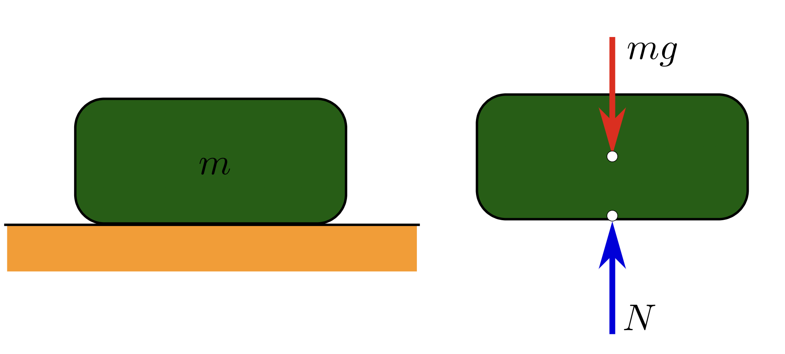
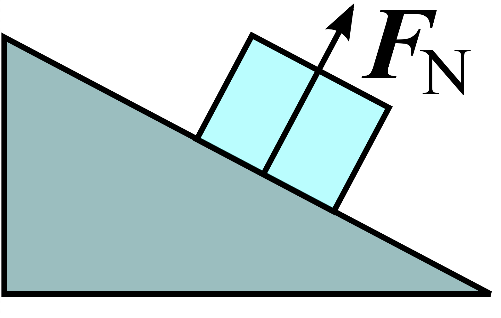
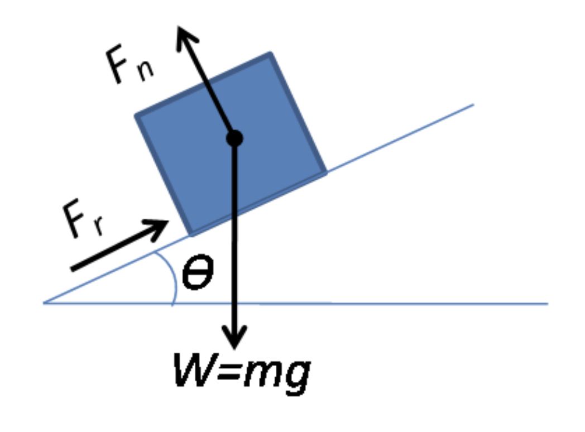
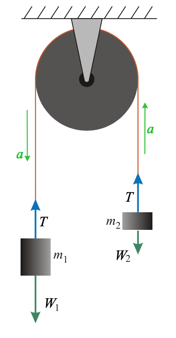

# clase-04

jueves 29 agosto 2024

unidad 2: dinámica

- definición de dinámica
- diagrama de cuerpo libre
- fuerza de peso
- fuerzas de contacto: fuerza normal y fuerzas de roce
- fuerza de tensión, cuerdas ideales y poleas
- máquina de Atwood

## definición de dinámica

acordémonos que en cinemática tratamos de encontrar expresiones matemáticas para describir la posición, velocidad y aceleración de cuerpos, sin importar la causa de sus cambios en posición, velocidad y aceleración.

en dinámica, por el contrario, tomaremos en cuenta las fuerzas y la segunda ecuación de Newton, que dice:

$$\vec{F} = m \cdot \vec{a}$$

## diagrama de cuerpo libre (DCL)

cuando resolvamos problemos de dinámica, crearemos diagramas de cuerpo libre, donde aislaremos cada cuerpo, y dibujaremos todas las fuerzas que le afectan, sin importar su origen.

esto nos permitirá escribir la segunda ecuación de Newton para cada cuerpo, donde la suma de todas las fuerzas sobre un cuerpo es igual a su masa multiplicada por su aceleración.

referencias:

- <https://es.wikipedia.org/wiki/Diagrama_de_cuerpo_libre>
- <https://en.wikipedia.org/wiki/Free_body_diagram>

a continuación veremos las fuerzas típicas que usaremos en nuestros diagramas de cuerpos libres.

## fuerza de peso

fuente: <https://en.wikipedia.org/wiki/Weight#/media/File:WeightNormal.svg>

la fuerza de peso se anota como W, por inglés "weight".

se mide en Newton, es una fuerza.

la ecuación para un cuerpo de masa m sujeta a una gravedad g es:

$$W = m \cdot g$$

la masa es inherente al cuerpo y constante, el peso depende de la gravedad, que es distinta en otros planetas.

la dirección de la fuerza de peso es hacia el centro del planeta, y por la curvatura del planeta tierra, podemos asumir que siempre es perpendicular al suelo y hacia abajo.

## fuerzas de contacto: fuerza normal y fuerzas de roce

fuente: <https://en.wikipedia.org/wiki/Normal_force#/media/File:Incline.svg>

la fuerza normal se anota como N, por normal.

se mide en Newton, es una fuerza.

la fuerza normal es una fuerza perpendicular a la superficie de contacto.

normal hace referencia al sentido geométrico de perpendicular, no de ordinario.

si somos un cuerpo y estamos en un plano, la fuerza normal y la fuerza de gravedad sobre nosotros se contrarrestan y la sumatoria de fuerzas en nosotros es cero, por lo tanto, no tenemos aceleración.

pero si estamos en un plano inclinado, la fuerza de gravedad sigue apuntando hacia el centro de la tierra, hacia abajo, y la fuerza normal es perpendicular al plano inclinado, en un ángulo, y la ecuación queda:

$$N = m \cdot g \cdot cos(\theta)$$

si esas fueran las dos únicas fuerzas sobre un cuerpo en un plano inclinado, la sumatoria sería siempre distinta de cero para cualquier ángulo distinto de cero, y por lo tanto siempre tendría aceleración.

pero por nuestra experiencia vital sabemos que podemos estar parados, sin acelerar, sobre planos inclinados! eso es porque hay otra fuerza en juego, que es la fuerza de roce.

la fuerza de roce es una fuerza, se mide en Netwon.

la fuerza de roce tiene dos sabores: estático y dinámico.

fuente: <https://en.wikipedia.org/wiki/Normal_force#/media/File:Friction_relative_to_normal_force_(diagram).png>

si descomponemos la fuerza normal, tiene una componente que se opone a la fuerza de gravedad, y otra que trata de hacer que el cuerpo se deslice por la superficie.

la fuerza de roce estático es la que se opone a que el cuerpo se deslice, y que les permite a los cuerpos poder estar sobre un plano inclinado sin acelerar.

esta fuerza de roce tiene un máximo valor, que va a ser dependiente del material y del ángulo de inclinación, que después de ser superados, el cuerpo se desliza y ya no tiene fuerza de roce estático.

cuando el cuerpo ya se está moviendo, deja de ser estático, ahora tiene una force de roce dinámico, que depende del material.

en general, el coeficiente de roce estático es mayor que dinámico, por lo que se necesita aplicar una fuerza para vencer el roce estático, y tras ser vencido, se necesita menos fuerza para mantenerlo en movimiento.

video con experimento: <https://www.youtube.com/watch?v=lzm0aSsSx8E>

## fuerza de tensión, cuerdas ideales y poleas

fuerza de tensión es una fuerza transmitida por una cuerda ideal:

- la cuerda ideal no tiene masa
- la cuerda ideal es inextensible / su largo es constante.

la fuerza de tensión se anota como T, por tensión.

la tensión se mide en Newton, es una fuerza.

el caso más simple para entender tensión, es de un cuerpo de masa m, sin acelerar, colgando de una cuerda anclada al techo.

el diagrama de cuerpo libre sobre este cuerpo presenta dos fuerzas:

- la fuerza de peso, ejercida por la tierra atrayendo el cuerpo hacia el suelo.
- la fuerza de tensión, ejercida por el techo y transmitiendo a través de la cuerda, atrayendo el cuerpo hacia el techo.

en el eje Y podemos escribir la ecuación:

$$T - m \cdot g = m \cdot a$$

y si no acelera, entonces:

$$T = m \cdot g$$

este es un caso similar al de un cuerpo sin acelerar en el suelo, donde el peso es contrarrestado por la fuerza normal, pero en este caso no hay fuerza normal, sino que hay fuerza de tensión.

## máquina de Atwood

fuente de la imagen: <https://en.wikipedia.org/wiki/Atwood_machine#/media/File:Atwood.svg>

<https://es.wikipedia.org/wiki/M%C3%A1quina_de_Atwood>

con los supuestos:

- la masa de la cuerda es 0 (en comparación con los cuerpos)
- la cuerda es inextensible, su largo siempre es constante.

consideramos dos cuerpos, con masas m1 y m2 conectados por una cuerda ideal a la misma polea.

nos damos cuenta que si uno acelera, el otro acelera con la misma magnitud y en dirección contraria, porque la cuerda es ideal e inextensible.

entonces si decimos que el cuerpo m1 acelera hacia abajo, escribimos su ecuación según su diagrama de cuerpo libre:

$$T - m_1 \cdot g = m_1 \cdot (-a)$$

y el otro cuerpo, entonces acelera hacia arriba y su ecuación es:

$$T - m_2 \cdot g = m_2 \cdot a$$

si despejamos la tensión de la primera ecuación, resulta:

$$T = m_1 \cdot (g - a)$$

y si reemplazamos esa tensión en la segunda ecuación, resulta:

$$(m_1 \cdot (g - a)) - m_2 \cdot g = m_2 \cdot a$$

expandiendo los términos:

$$m_1 \cdot g - m_1 \cdot a - m_2 \cdot g = m_2 \cdot a$$

agrupando a:

$$m_1 \cdot g - m_2 \cdot g = m_1 \cdot a + m_2 \cdot a$$

y despejando a:

$$a = g \cdot \frac{m1 - m2}{m1+ m2}$$

la aceleración es un múltiplo de la gravedad, y depende de la relación entre las masas, vemos que la aceleración que definimos será positiva cuando m1 sea mayor que m2, y que invertirá su signo cuando m2 sea mayor que m1.

como tenemos a, podemos ahora despejar T:

$$T = m_1 \cdot (g - a) = m_1 \cdot (g - g \cdot \frac{m1 - m2}{m1+ m2})$$

y desarrollando:

$$T = m_1 \cdot g \cdot (1 - \frac{m_1 - m_2}{m_1 + m_2})$$

expresamos 1 como la suma de m1 y m2 dividida por sí misma:

$$T = m_1 \cdot g \cdot (\frac{m_1 + m_2}{m_1 + m_2} - \frac{m_1 - m_2}{m_1 + m_2})$$

y con eso simplificamos:

$$T = m_1 \cdot g \cdot (\frac{2 \cdot m_2}{m_1 + m_2})$$

y resulta una tensión que depende de las masas m1 y m2.

$$T = g \cdot \frac{m_1 \cdot m_2}{m_1 + m_2}$$

notamos que si $m_1$ y $m_2$ son iguales, entonces la aceleración se hace cero, independiente del largo de la cuerda o la posición de las masas.

como siempre, aceleración cero no implica velocidad cero, solamente implica velocidad constante.

## referencias

- <https://www.khanacademy.org/science/physics/forces-newtons-laws/normal-contact-force/v/normal-force-and-contact-force>
- <https://www.khanacademy.org/science/physics/forces-newtons-laws#inclined-planes-friction>
